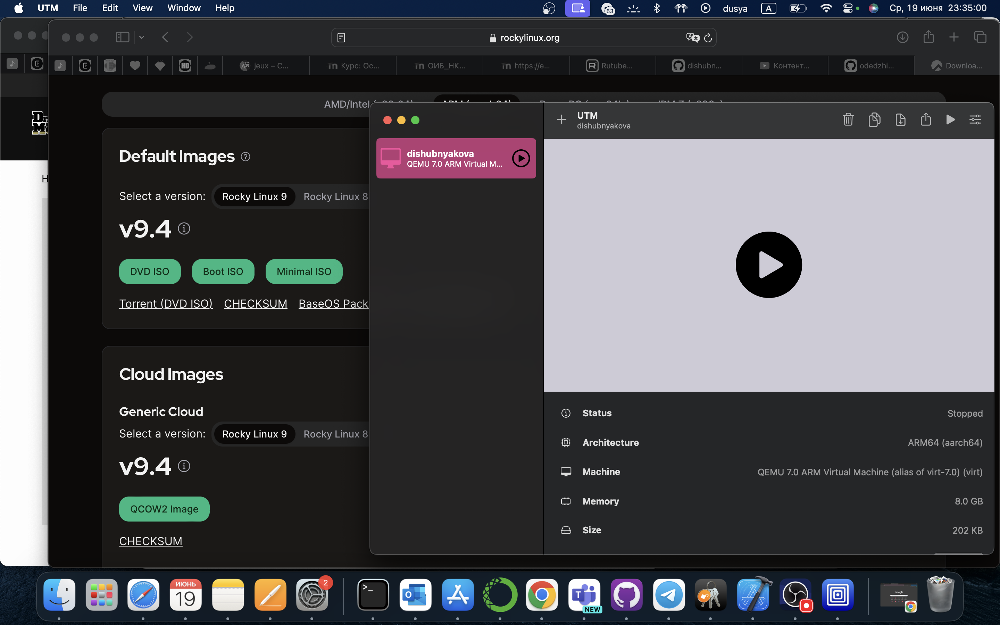

---
## Front matter
lang: ru-RU
title: Проект. Этап 1.
subtitle: Kali Linux
author:
  - Шубнякова Дарья Игоревна НКАбд-03-22
institute:
  - Российский университет дружбы народов, Москва, Россия
date: 18 июня 2024

## i18n babel
babel-lang: russian
babel-otherlangs: english

## Formatting pdf
toc: false
toc-title: Содержание
slide_level: 2
aspectratio: 169
section-titles: true
theme: metropolis
header-includes:
 - \metroset{progressbar=frametitle,sectionpage=progressbar,numbering=fraction}
 - '\makeatletter'
 - '\beamer@ignorenonframefalse'
 - '\makeatother'
---

## Актуальность

- Система Kali Linux была разработана в 2013 году по примеру операционки BackTrack, используемой в качестве инструмента тестирования информационной безопасности. Работала над ней профильная команда из Offensive Security, а за основу взята структура Debian. Новый продукт стали создавать на волне слияния проектов WHAX и Auditor Security Collection.
- Используют его и компьютерные энтузиасты при изучении технологий, когда нужно побольше узнать о схеме проведения сетевых атак. Такой подход к обучению упрощает понимание, как защищаться от хакеров, вирусов и других сетевых угроз. Дистрибутив Kali Linux представляет собой набор инструментов, а кто и как его будет применять, зависит от ситуации.

## Цели и задачи

- Установить дистрибутив Kali Linux в виртуальную машину.
- В качестве среды виртуализации предлагается использовать VirtualBox.
- В моем случае использовлась среда UTM.

## Процесс

## Результаты

- Нами была установлен дистрибутив Kali Linux для дальнейшей работы

