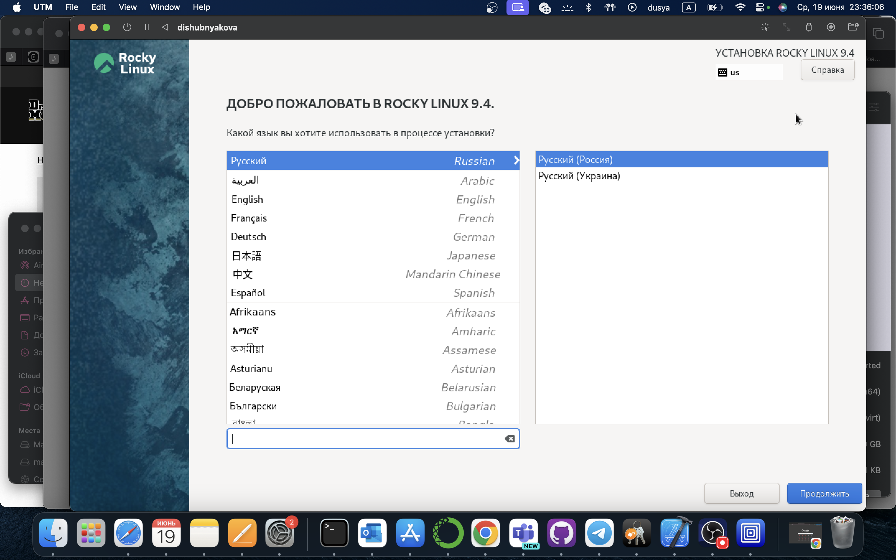
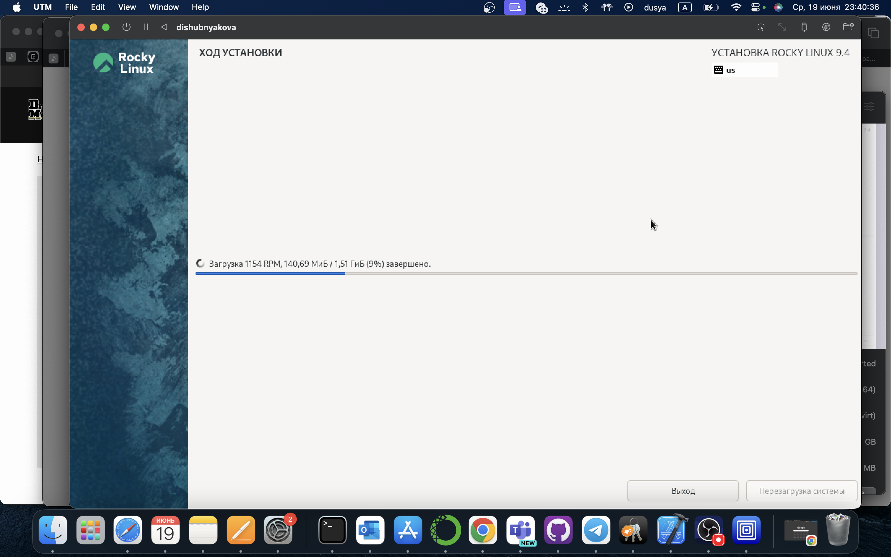
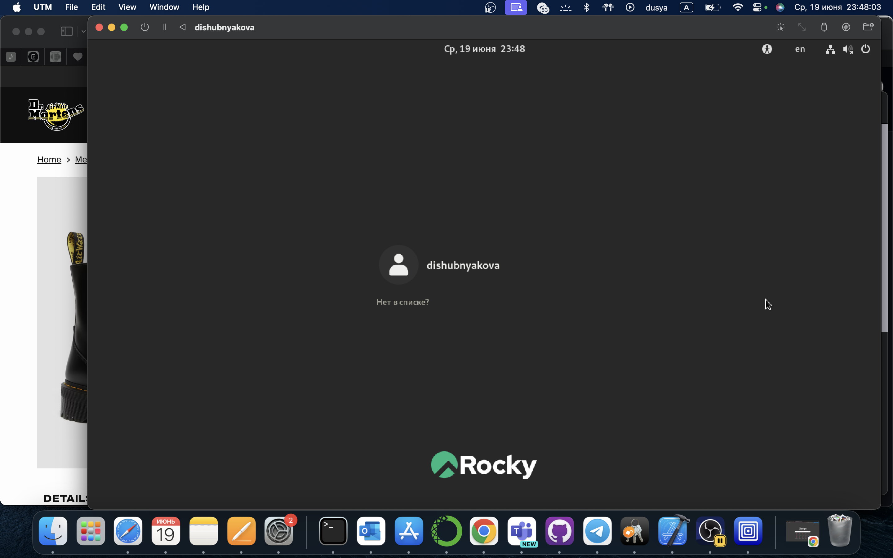
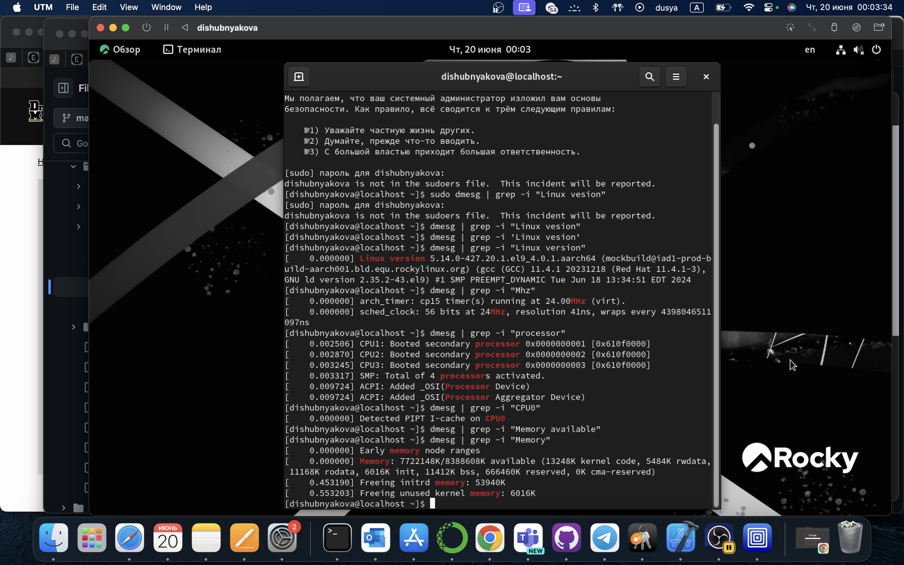
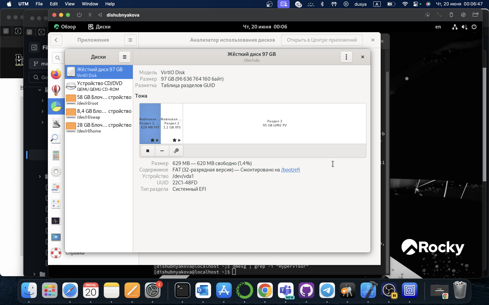

---
## Front matter
lang: ru-RU
title: Лабораторная работа №1
author:
  - Шубнякова Дарья Игоревна НКАбд-03-22
institute:
  - Российский университет дружбы народов, Москва, Россия
date: 19.06.24

## i18n babel
babel-lang: russian
babel-otherlangs: english

## Formatting pdf
toc: false
toc-title: Содержание
slide_level: 2
aspectratio: 169
section-titles: true
theme: metropolis
header-includes:
 - \metroset{progressbar=frametitle,sectionpage=progressbar,numbering=fraction}
 - '\makeatletter'
 - '\makeatother'
 
---

## Цели работы

* Целью данной работы является приобретение практических навыков установки операционной системы на виртуальную машину, настройки минимально необходимых для дальнейшей работы сервисов.
* Лабораторная работа подразумевает установку на виртуальную машину VirtualBox (https://www.virtualbox.org/) операционной системы Linux (дистрибутив Rocky (https://rockylinux.org/)).

## Процесс выполнения

## Процесс выполнения

## Процесс выполнения

## Процесс выполнения

## Процесс выполнения

## Процесс выполнения

## Итоги

1. Реализовали установку дистрибутива Linux Rocky в UTM
2. Узнали необходимую информацию о системе
3. Проделали все необходимые настройки для дальнейшей работы

