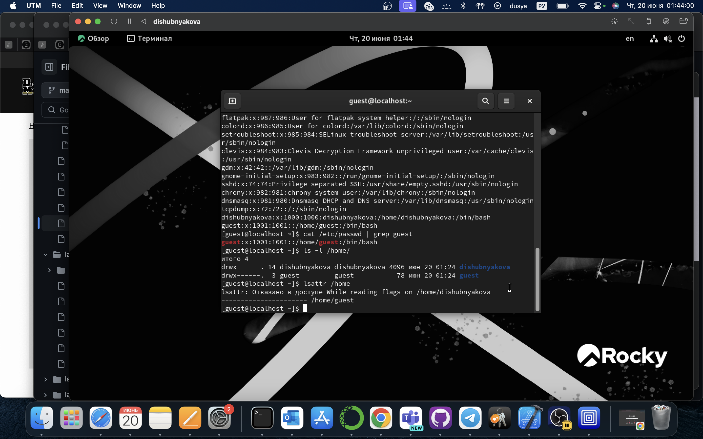

---
## Front matter
lang: ru-RU
title: Лабораторная работа №2
author:
  - Шубнякова Дарья Игоревна НКАбд-03-22
institute:
  - Российский университет дружбы народов, Москва, Россия
date: 20.06.24

## i18n babel
babel-lang: russian
babel-otherlangs: english

## Formatting pdf
toc: false
toc-title: Содержание
slide_level: 2
aspectratio: 169
section-titles: true
theme: metropolis
header-includes:
 - \metroset{progressbar=frametitle,sectionpage=progressbar,numbering=fraction}
 - '\makeatletter'
 - '\makeatother'
 
---

## Цели работы

Получение практических навыков работы в консоли с атрибутами файлов, закрепление теоретических основ дискреционного разграничения доступа в современных системах с открытым кодом на базе ОС Linux.

## Процесс выполнения


## Процесс выполнения


## Процесс выполнения



## Процесс выполнения


## Процесс выполнения


## Процесс выполнения


## Процесс выполнения (пункт 15 на основании 14)

: Минимальные права для совершения операций {#tbl:min-rig}

|Операция|Права на директорию|Права на файл|
|:---:|:---:|:---:|
|Создание файла|```d-wx------ (300)```|```---------- (000)```|        
|Удаление файла|```d-wx------ (300)```|```---------- (000)```|
|Чтение файла|```d--x------ (100)```|```-r-------- (400)```|
|Запись в файл|```d--x------ (100)```|```--w------- (200)```|
|Переименование файла|```d-wx------ (300)```|```----------(000)```|
|Создание поддиректории|```d-wx------ (300)```|```---------- (000)```|
|Удаление поддиректории|```d-wx------ (300)```|```---------- (000)```|

## Итоги

В ходе выполнения лабораторной работы были получены навыки работы с атрибутами файлов и сведения о разграничении доступа.

## Список литературы

1. [Теория разграничения прав пользователей](https://moodle.kstu.ru/pluginfile.php/318215/mod_resource/content/1/Теория_разграничение_прав_пользователи.pdf)
2. [Разрешения доступа к файлам](https://linuxcommand.ru/razresheniya-dostupa-k-failam/)


