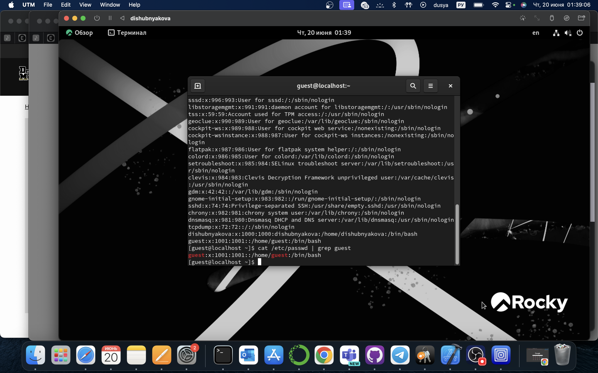
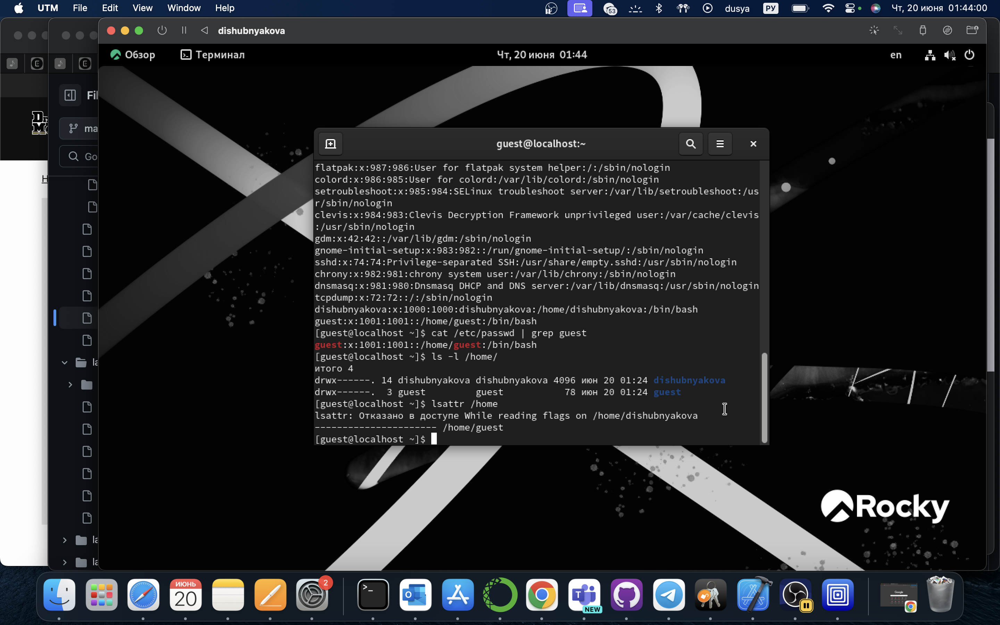
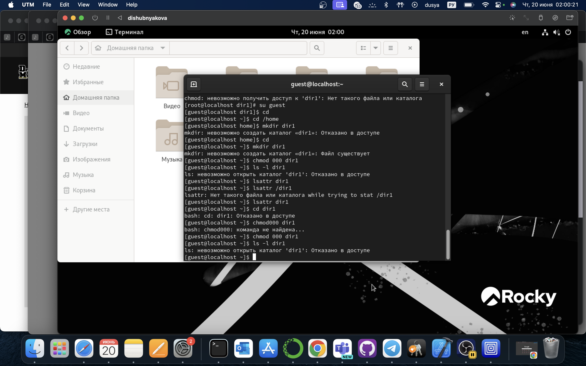
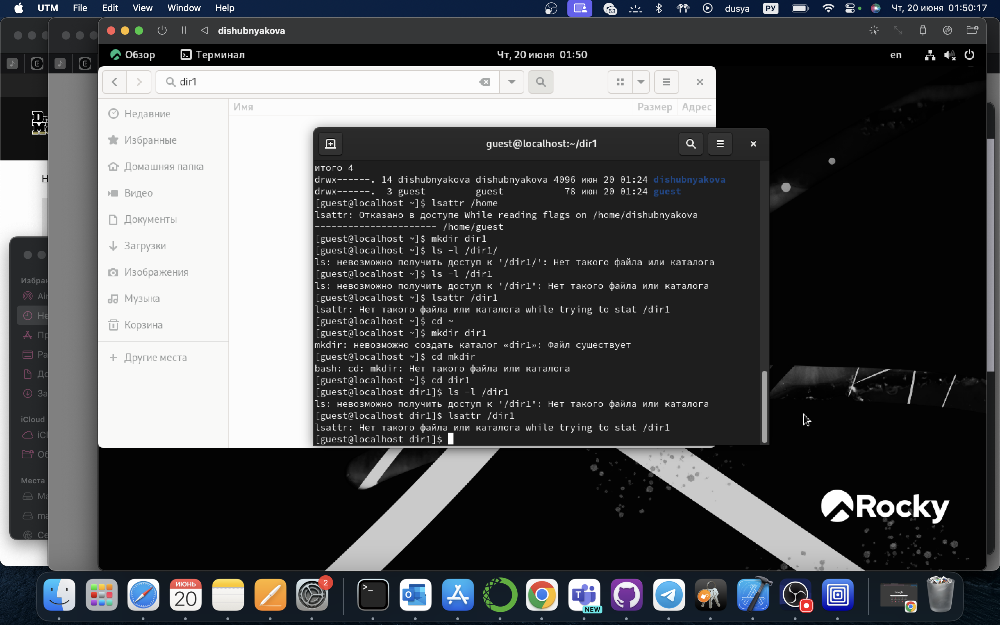
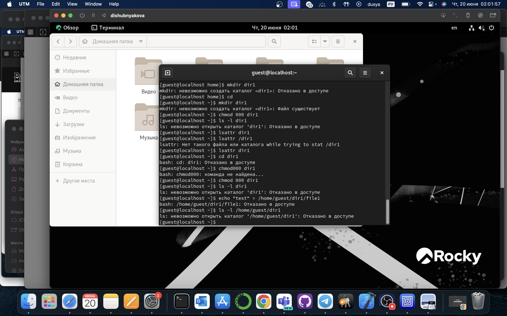

---
## Front matter
title: "Лабораторная работа №2"
subtitle: "НКАбд-03-22"
author: "Шубнякова Дарья"

## Generic otions
lang: ru-RU
toc-title: "Содержание"

## Bibliography
bibliography: bib/cite.bib
csl: pandoc/csl/gost-r-7-0-5-2008-numeric.csl

## Pdf output format
toc: true # Table of contents
toc-depth: 2
lof: true # List of figures
lot: true # List of tables
fontsize: 12pt
linestretch: 1.5
papersize: a4
documentclass: scrreprt
## I18n polyglossia
polyglossia-lang:
  name: russian
  options:
    - spelling=modern
    - babelshorthands=true
polyglossia-otherlangs:
  name: english
## I18n babel
babel-lang: russian
babel-otherlangs: english
## Fonts
mainfont: PT Serif
romanfont: PT Serif
sansfont: PT Sans
monofont: PT Mono
mainfontoptions: Ligatures=TeX
romanfontoptions: Ligatures=TeX
sansfontoptions: Ligatures=TeX,Scale=MatchLowercase
monofontoptions: Scale=MatchLowercase,Scale=0.9
## Biblatex
biblatex: true
biblio-style: "gost-numeric"
biblatexoptions:
  - parentracker=true
  - backend=biber
  - hyperref=auto
  - language=auto
  - autolang=other*
  - citestyle=gost-numeric
## Pandoc-crossref LaTeX customization
figureTitle: "Рис."
tableTitle: "Таблица"
listingTitle: "Листинг"
lofTitle: "Список иллюстраций"
lotTitle: "Список таблиц"
lolTitle: "Листинги"
## Misc options
indent: true
header-includes:
  - \usepackage{indentfirst}
  - \usepackage{float} # keep figures where there are in the text
  - \floatplacement{figure}{H} # keep figures where there are in the text
---

# Цель работы

Получение практических навыков работы в консоли с атрибутами файлов, закрепление теоретических основ дискреционного разграничения доступа в современных системах с открытым кодом на базе ОС Linux.

# Выполнение лабораторной работы

1.    В установленной при выполнении предыдущей лабораторной работы операционной системе создали учётную запись пользователя guest (используя учётную запись администратора) 
2.    Задали пароль для пользователя guest (используя учётную запись администратора)

3.    Вошли в систему от имени пользователя guest

4.    Командой pwd определили директорию, в которой находимся и определили является ли она домашней директорией

5.    Уточнили имя нашего пользователя командой whoami:

6.    Уточнили имя пользователя, его группу, а также группы, куда входит пользователь, командой id. Выведенные значения uid, gid и др. Сравнили вывод id с выводом команды groups. Видим, что gid и группы = 1001(guest)

7. Сравним полученную информацию об имени пользователя с данными, выводимыми в приглашении командной строки и убедимся, что они совпадают


8. Просмотрим файл /etc/passwd Командой: cat /etc/passwd. Найдем в нём свою учётную запись. Определим uid пользователя. Определим gid пользователя. Сравним найденные значения с полученными в предыдущих пунктах. Guest имеет те же идентификаторы 1001, наш пользователь под идентификатором 1002.



9.    Определим существующие в системе директории командой ls -l /home/
 
10.    Проверили, какие расширенные атрибуты установлены на поддиректориях, находящихся в директории /home, командой: lsattr /home. Нам не удалось увидеть расширенные атрибуты директорий других пользователей, только своей домашней директории.



11. Создали в домашней директории поддиректорию dir1 командой mkdir dir1. Определим командами ls -l и lsattr, какие права доступа и расширенные атрибуты были выставлены на директорию dir1.



12. Создали в домашней директории поддиректорию dir1 командой mkdir dir1. Определим командами ls -l и lsattr, какие права доступа и расширенные атрибуты были выставлены на директорию dir1.



13. Создали в директории dir1 файл file1 командой echo "test" > /home/guest/dir1/file1. Поскольку ранее мы отозвали все атрибуты, то тем самым лишили всех прав на взаимодействие с dir1.



14. Заполняем таблицу «Установленные права и разрешённые действия»

|Права директории|Права файла|1|2|3|4|5|6|7|8|
|:---|:---|---|---|---|---|---|---|---|---|
|```d---------(000)```|```----------(000)```|-|-|-|-|-|-|-|-|
|```d--x------(100)```|```----------(000)```|-|-|-|-|+|-|-|+|
|```d-w-------(200)```|```----------(000)```|-|-|-|-|-|-|-|-|
|```d-wx------(300)```|```----------(000)```|+|+|-|-|+|-|+|+|
|```dr--------(400)```|```----------(000)```|-|-|-|-|-|-|-|-|
|```dr-x------(500)```|```----------(000)```|-|-|-|-|+|+|-|+|
|```drw-------(600)```|```----------(000)```|-|-|-|-|-|-|-|-|
|```drwx------(700)```|```----------(000)```|+|+|-|-|+|+|+|+|
|```d---------(000)```|```---x------(100)```|-|-|-|-|-|-|-|-|
|```d--x------(100)```|```---x------(100)```|-|-|-|-|+|-|-|+|
|```d-w-------(200)```|```---x------(100)```|-|-|-|-|-|-|-|-|
|```d-wx------(300)```|```---x------(100)```|+|+|-|-|+|-|+|+|
|```dr--------(400)```|```---x------(100)```|-|-|-|-|-|-|-|-|
|```dr-x------(500)```|```---x------(100)```|-|-|-|-|+|+|-|+|
|```drw-------(600)```|```---x------(100)```|-|-|-|-|-|-|-|-|
|```drwx------(700)```|```---x------(100)```|+|+|-|-|+|+|+|+|
|```d---------(000)```|```--w-------(200)```|-|-|-|-|-|-|-|-|
|```d--x------(100)```|```--w-------(200)```|-|-|+|-|+|-|-|+|
|```d-w-------(200)```|```--w-------(200)```|-|-|-|-|-|-|-|-|
|```d-wx------(300)```|```--w-------(200)```|+|+|+|-|+|-|+|+|
|```dr--------(400)```|```--w-------(200)```|-|-|-|-|-|-|-|-|
|```dr-x------(500)```|```--w-------(200)```|-|-|+|-|+|+|-|+|
|```drw-------(600)```|```--w-------(200)```|-|-|-|-|-|-|-|-|
|```drwx------(700)```|```--w-------(200)```|+|+|+|-|+|+|+|+|
|```d---------(000)```|```--wx------(300)```|-|-|-|-|-|-|-|-|
|```d--x------(100)```|```--wx------(300)```|-|-|+|-|+|-|-|+|
|```d-w-------(200)```|```--wx------(300)```|-|-|-|-|-|-|-|-|
|```d-wx------(300)```|```--wx------(300)```|+|+|+|-|+|-|+|+|
|```dr--------(400)```|```--wx------(300)```|-|-|-|-|-|-|-|-|
|```dr-x------(500)```|```--wx------(300)```|-|-|+|-|+|+|-|+|
|```drw-------(600)```|```--wx------(300)```|-|-|-|-|-|-|-|-|
|```drwx------(700)```|```--wx------(300)```|+|+|+|-|+|+|+|+|
|```d---------(000)```|```-r--------(400)```|-|-|-|-|-|-|-|-|
|```d--x------(100)```|```-r--------(400)```|-|-|-|+|+|-|-|+|
|```d-w-------(200)```|```-r--------(400)```|-|-|-|-|-|-|-|-|
|```d-wx------(300)```|```-r--------(400)```|+|+|-|+|+|-|+|+|
|```dr--------(400)```|```-r--------(400)```|-|-|-|-|-|-|-|-|
|```dr-x------(500)```|```-r--------(400)```|-|-|-|+|+|+|-|+|
|```drw-------(600)```|```-r--------(400)```|-|-|-|-|-|-|-|-|
|```drwx------(700)```|```-r--------(400)```|+|+|-|+|+|+|+|+|
|```d---------(000)```|```-r-x------(500)```|-|-|-|-|-|-|-|-|
|```d--x------(100)```|```-r-x------(500)```|-|-|-|+|+|-|-|+|
|```d-w-------(200)```|```-r-x------(500)```|-|-|-|-|-|-|-|-|
|```d-wx------(300)```|```-r-x------(500)```|+|+|-|+|+|-|+|+|
|```dr--------(400)```|```-r-x------(500)```|-|-|-|-|-|-|-|-|
|```dr-x------(500)```|```-r-x------(500)```|-|-|-|+|+|+|-|+|
|```drw-------(600)```|```-r-x------(500)```|-|-|-|-|-|-|-|-|
|```drwx------(700)```|```-r-x------(500)```|+|+|-|+|+|+|+|+|
|```d---------(000)```|```-rw-------(600)```|-|-|-|-|-|-|-|-|
|```d--x------(100)```|```-rw-------(600)```|-|-|+|+|+|-|-|+|
|```d-w-------(200)```|```-rw-------(600)```|-|-|-|-|-|-|-|-|
|```d-wx------(300)```|```-rw-------(600)```|+|+|+|+|+|-|+|+|
|```dr--------(400)```|```-rw-------(600)```|-|-|-|-|-|-|-|-|
|```dr-x------(500)```|```-rw-------(600)```|-|-|+|+|+|+|-|+|
|```drw-------(600)```|```-rw-------(600)```|-|-|-|-|-|-|-|-|
|```drwx------(700)```|```-rw-------(600)```|+|+|+|+|+|+|+|+|
|```d---------(000)```|```-rwx------(700)```|-|-|-|-|-|-|-|-|
|```d--x------(100)```|```-rwx------(700)```|-|-|+|+|+|-|-|+|
|```d-w-------(200)```|```-rwx------(700)```|-|-|-|-|-|-|-|-|
|```d-wx------(300)```|```-rwx------(700)```|+|+|+|+|+|-|+|+|
|```dr--------(400)```|```-rwx------(700)```|-|-|-|-|-|-|-|-|
|```dr-x------(500)```|```-rwx------(700)```|-|-|+|+|+|+|-|+|
|```drw-------(600)```|```-rwx------(700)```|-|-|-|-|-|-|-|-|
|```drwx------(700)```|```-rwx------(700)```|+|+|+|+|+|+|+|+|

На основании таблицы выше определили минимально необходимые права для выполнения операций внутри директории dir1 и заполнили таблицу [-@tbl:min-rig]. Для заполнения последних двух строк опытным путем проверили минимальные права. 

15. На основании заполненной таблицы определили те или иные минимально необходимые права для выполнения операций внутри директории dir1 и сделали новую.

: Минимальные права для совершения операций {#tbl:min-rig}

|Операция|Права на директорию|Права на файл|
|:---:|:---:|:---:|
|Создание файла|```d-wx------ (300)```|```---------- (000)```|        
|Удаление файла|```d-wx------ (300)```|```---------- (000)```|
|Чтение файла|```d--x------ (100)```|```-r-------- (400)```|
|Запись в файл|```d--x------ (100)```|```--w------- (200)```|
|Переименование файла|```d-wx------ (300)```|```----------(000)```|
|Создание поддиректории|```d-wx------ (300)```|```---------- (000)```|
|Удаление поддиректории|```d-wx------ (300)```|```---------- (000)```|

# Выводы

В ходе выполнения лабораторной работы были получены навыки работы с атрибутами файлов и сведения о разграничении доступа.

# Список литературы{.unnumbered}

1. [Теория разграничения прав пользователей](https://moodle.kstu.ru/pluginfile.php/318215/mod_resource/content/1/Теория_разграничение_прав_пользователи.pdf)
2. [Разрешения доступа к файлам](https://linuxcommand.ru/razresheniya-dostupa-k-failam/)
