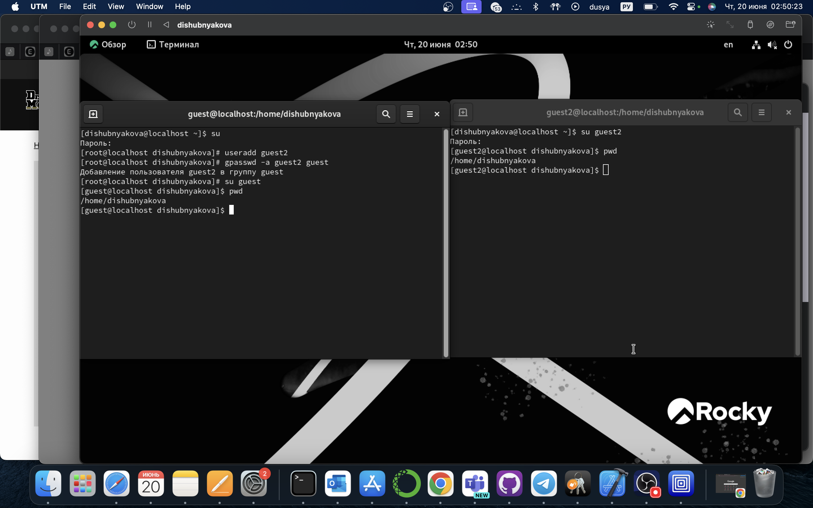
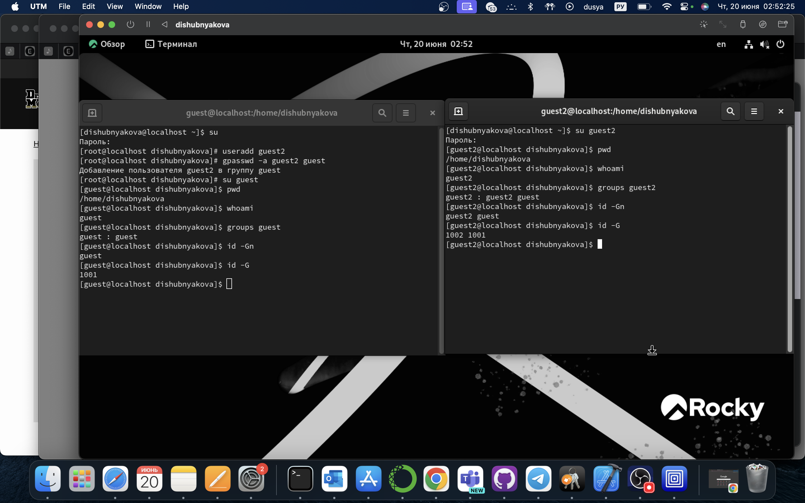
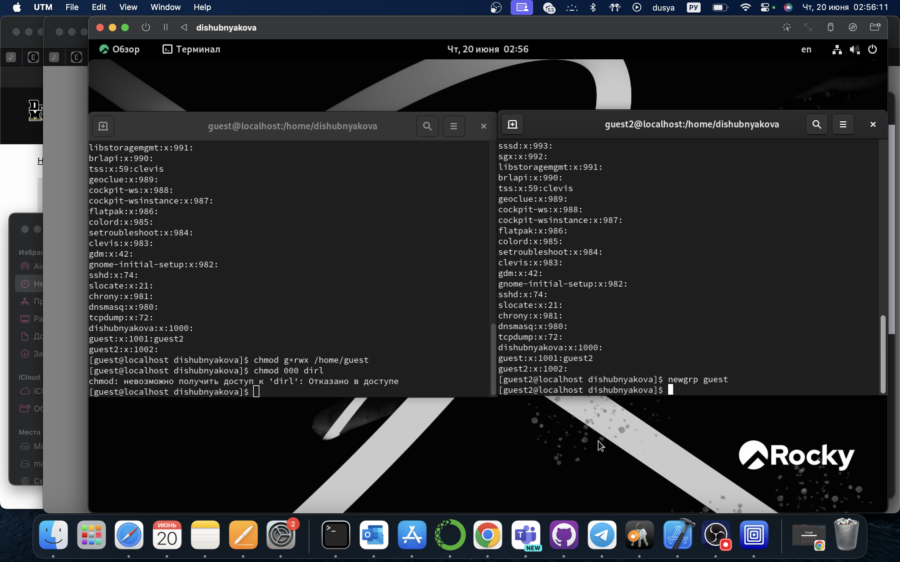

---
## Front matter
lang: ru-RU
title: Лабораторная работа №3
author:
  - Шубнякова Дарья Игоревна НКАбд-03-22
institute:
  - Российский университет дружбы народов, Москва, Россия
date: 19.06.24

## i18n babel
babel-lang: russian
babel-otherlangs: english

## Formatting pdf
toc: false
toc-title: Содержание
slide_level: 2
aspectratio: 169
section-titles: true
theme: metropolis
header-includes:
 - \metroset{progressbar=frametitle,sectionpage=progressbar,numbering=fraction}
 - '\makeatletter'
 - '\makeatother'
 
---

## Цели работы

Получение практических навыков работы в консоли с атрибутами фай- лов для групп пользователей.

## Процесс выполнения

## Процесс выполнения

## Процесс выполнения

## Процесс выполнения

## Процесс выполнения

Меняя атрибуты у директории dir1 и файла file1 от имени пользователя guest и делая проверку от пользователя guest2, заполнили табл. 2, определили опытным путём, какие операции разрешены, а какие нет. Если операция разрешена, занесли в таблицу знак «+», если не разрешена, знак «-». На основании заполненной таблицы определили те или иные минимально необходимые права для выполнения пользователем guest2 операций внутри директории dir1 и заполнили две таблицы.

## Итоги

В ходе выполнения работы, мы смогли приобрести практические навыки работы в консоли с атрибутами файлов для групп пользователей.

## Список литературы

1. [Теория разграничения прав пользователей](https://moodle.kstu.ru/pluginfile.php/318215/mod_resource/content/1/Теория_разграничение_прав_пользователи.pdf)
2. [Разрешения доступа к файлам](https://linuxcommand.ru/razresheniya-dostupa-k-failam/)

