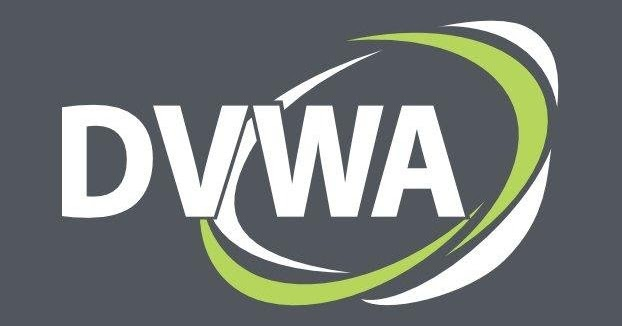

---
## Front matter
lang: rus
fontenc: T2A
title: Проект. Этап 2.
subtitle: Установка DVWA
author:
  - Шубнякова Дарья Игоревна НКАбд-03-22
institute:
  - Российский университет дружбы народов, Москва, Россия
date: 19.06.24

## i18n babel
babel-lang: russian
babel-otherlangs: english

## Formatting pdf
toc: false
toc-title: Содержание
slide_level: 2
aspectratio: 169
section-titles: true
theme: metropolis
header-includes:
 - \metroset{progressbar=frametitle,sectionpage=progressbar,numbering=fraction}
 - '\makeatletter'
 - '\makeatother'
---

## Актуальность

- Damn Vulnerable Web Application (DVWA) — это намеренно уязвимое веб-приложение на PHP/MySQL. Цель проекта — помочь этичным хакерам и специалистам ИБ отточить свои навыки и протестировать инструменты.
- DVWA также может помочь веб-разработчикам и изучающим ИБ, лучше понять процесс безопасности веб-приложений.

## DVWA

## Цели и задачи

- Установить DVWA в гостевую систему к Kali Linux.
- Репозиторий: https://github.com/digininja/DVWA.

## Процесс

Некоторые из уязвимостей веб приложений, который содержит DVWA:
- Брутфорс: Брутфорс HTTP формы страницы входа - используется для тестирования инструментов по атаке на пароль методом грубой силы и показывает небезопасность слабых паролей.
- Межсайтовая подделка запроса (CSRF): Позволяет «атакующему» изменить пароль администратора приложений.
- Внедрение (инклуд) файлов: Позволяет «атакующему» присоединить удалённые/локальные файлы в веб приложение.

## Процесс

- SQL внедрение: Позволяет «атакующему» внедрить SQL выражения в HTTP из поля ввода, DVWA включает слепое и основанное на ошибке SQL внедрение.
- Небезопасная выгрузка файлов: Позволяет «атакующему» выгрузить вредоносные файлы на веб сервер.
- Межсайтовый скриптинг (XSS): «Атакующий» может внедрить свои скрипты в веб приложение/базу данных. DVWA включает отражённую и хранимую XSS.
- Пасхальные яйца: раскрытие полных путей, обход аутентификации и некоторые другие.

## Три уровня безопасности DVWA

- Невозможный — этот уровень должен быть безопасным от всех уязвимостей.
- Высокий — это расширение среднего уровня сложности, со смесью более сложных или альтернативных плохих практик в попытке обезопасить код. 
- Средний — этот уровень безопасности предназначен главным образом для того, чтобы дать пользователю пример плохих практик безопасности, где разработчик попытался сделать приложение безопасным, но потерпел неудачу.
- Низкий — этот уровень безопасности совершенно уязвим и совсем не имеет защиты.

## Результаты

Damn Vulnerable Web Application (DVWA) — это настоятельно рекомендуемый инструмент для тестирования безопасности веб-приложений из-за его дидактической ценности, всестороннего охвата уязвимостей и практического подхода к обучению. Используя DVWA, люди могут получить практический опыт в выявлении и использовании уязвимостей, обычно встречающихся в веб-приложениях, тем самым повышая свои навыки в тестировании безопасности веб-приложений.

