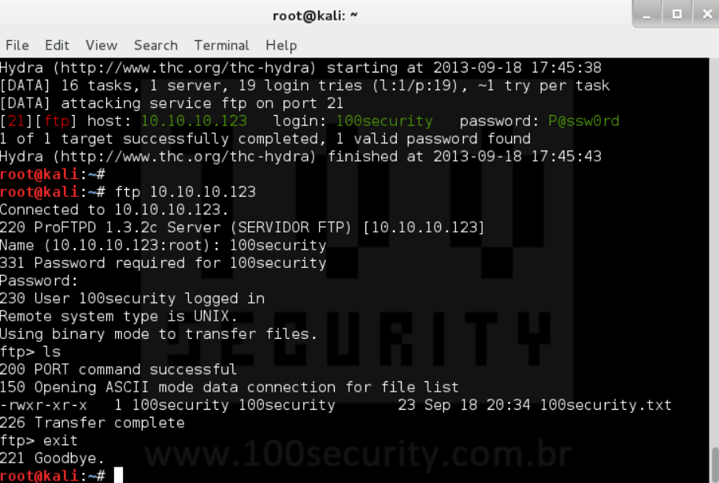

---
## Front matter
lang: ru-RU
title: Проект. Этап 3.
subtitle: Использование Hydra
author:
  - Шубнякова Дарья Игоревна НКАбд-03-22
institute:
  - Российский университет дружбы народов, Москва, Россия
date: 18 июня 2024

## i18n babel
babel-lang: russian
babel-otherlangs: english

## Formatting pdf
toc: false
toc-title: Содержание
slide_level: 2
aspectratio: 169
section-titles: true
theme: metropolis
header-includes:
 - \metroset{progressbar=frametitle,sectionpage=progressbar,numbering=fraction}
 - '\makeatletter'
 - '\makeatother'
---

## Актуальность

* Поддерживает подбор для большого набора приложений.
* Hydra используется для подбора или взлома имени пользователя и пароля.

## Hydra

## Цели и задачи

* Установить Hydra
* Изучить предоставленный пример работы с ней

## Процесс

## Пример работы. Исходные данные.

* IP сервера 178.72.90.181;
* Сервис http на стандартном 80 порту;
* Для авторизации используется html форма, которая отправляет по адресу http://178.72.90.181/cgi-bin/luci методом POST запрос вида username=root&password=test_password;
* В случае не удачной аутентификации пользователь наблюдает сообщение Invalid username and/or password! Please try again.

## Пример работы. Запрос.

Используется http-post-form потому, что авторизация происходит по http методом post.
hydra -l root -P ~/pass_lists/dedik_passes.txt -o ./hydra_result.log -f -V -s 80 178.72.90.181 http-post-form "/cgi-bin/luci:username=^USER^&password=^PASS^:Invalid username"
После указания этого модуля идёт строка /cgi-bin/luci:username=^USER^&password=^PASS^:Invalid username, у которой через двоеточие (:) указывается:
- путь до скрипта, который обрабатывает процесс аутентификации (/cgi-bin/luci);
- строка, которая передаётся методом POST, в которой логин и пароль заменены на ^USER^ и ^PASS^ соответственно (username=^USER^&password=^PASS^); 
- строка, которая присутствует на странице при неудачной аутентификации; при её отсутствии Hydra поймёт, что мы успешно вошли (Invalid username).

## Результаты

- Ознакомились с работой Hydra, которая поддерживает огромное количество служб, благодаря своей быстроте и надёжности она завоевала заслуженную признательность среди тестеров на проникновение. 

