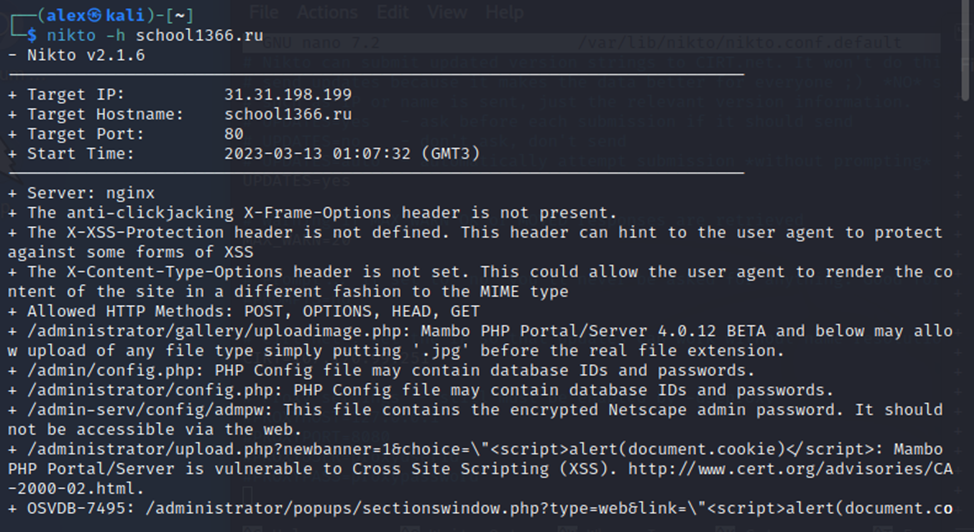
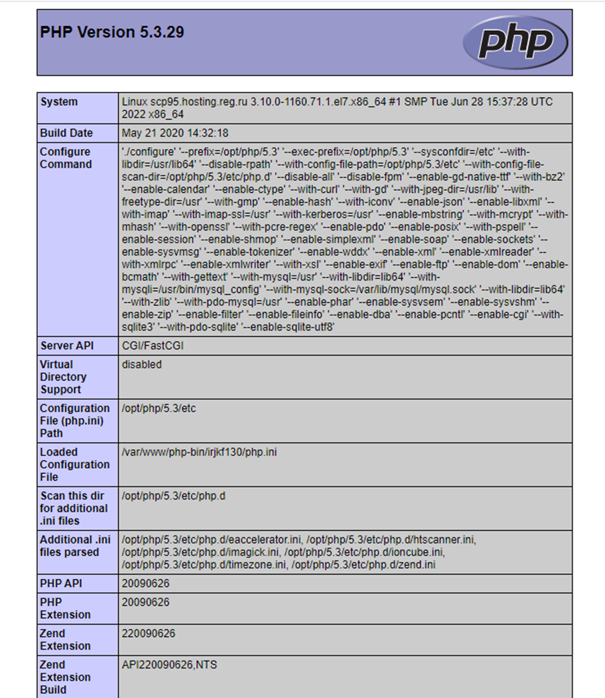

---
## Front matter
lang: ru-RU
title: Проект. Этап 4.
subtitle: Использование nikto
author:
  - Шубнякова Дарья Игоревна НКАбд-03-22
institute:
  - Российский университет дружбы народов, Москва, Россия
date: 19 июня 2024

## i18n babel
babel-lang: russian
babel-otherlangs: english

## Formatting pdf
toc: false
toc-title: Содержание
slide_level: 2
aspectratio: 169
section-titles: true
theme: metropolis
header-includes:
 - \metroset{progressbar=frametitle,sectionpage=progressbar,numbering=fraction}
 - '\makeatletter'
 - '\makeatother'
---

## Актуальность

Nikto – бесплатный (open source) сканер для поиска уязвимостей в веб-серверах. Утилита относиться к классу blackbox сканеров, т. е. сканеров, использующих стратегию сканирования методом черного ящика. Это значит, что заранее неизвестно о внутреннем устройстве программы/сайта (доступ к исходному коду отсутствует) и упор сделан на функциональность. Программа может обнаруживать более 6700 потенциально опасных файлов и уязвимостей. 

## Актуальность

Новые уязвимости добавляются в базу данных программы по мере их возникновения. Помимо поиска уязвимостей, сканер производит поиск на наличие устаревших версий, используемых библиотек и фреймворков. Nikto не позиционируется как стелс сканер (стелс сканеры никогда не устанавливают TCP-соединения до конца, тем самым сканирование происходит скрытно) – при сканировании сайта в логах сайта или в любой другой системе обнаружения вторжений, если она используется, будет отображена информация о том, что сайт подвергается сканированию.

## Цели и задачи

* Ознакомиться со сканером nikto
* Установить его
 
## Процесс начала работы

## В начале сканирования всегда отображается следующий блок с информацией

## Результаты

В ходе выполнения работы мы ознакомились с базовым сканером безопасности веб-сервера, который сканирует и обнаруживает уязвимости в веб-приложениях, обычно вызванные неправильной конфигурацией на самом сервере, файлами, установленными по умолчанию, и небезопасными файлами, а также устаревшими серверными приложениями.

