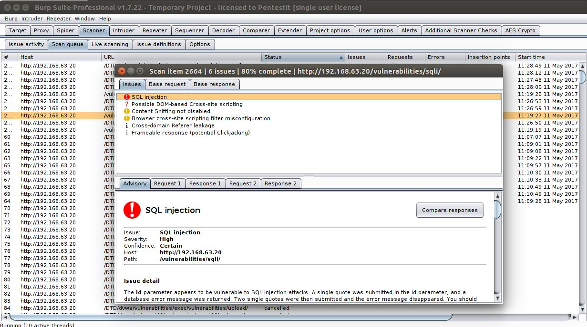

---
## Front matter
lang: ru-RU
title: Проект. Этап 5.
subtitle: Использование Burp Suite
author:
  - Шубнякова Дарья Игоревна НКАбд-03-22
institute:
  - Российский университет дружбы народов, Москва, Россия
date: 19 июня 2024

## i18n babel
babel-lang: russian
babel-otherlangs: english

## Formatting pdf
toc: false
toc-title: Содержание
slide_level: 2
aspectratio: 169
section-titles: true
theme: metropolis
header-includes:
 - \metroset{progressbar=frametitle,sectionpage=progressbar,numbering=fraction}
 - '\makeatletter'
 - '\makeatother'
---

## Актуальность

Burp Suite – это мультитул для проведения аудита безопасности веб-приложений. Содержит инструменты для составления карты веб-приложения, поиска файлов и папок, модификации запросов, фаззинга, подбора паролей и многое другое. Также существует магазин дополнений BApp store, содержащий дополнительные расширения, увеличивающие функционал приложения. Стоит отметить и появление в последнем релизе мобильного помощника для исследования безопасности мобильных приложений — MobileAssistant для платформы iOS.

## Burp Suite

## Цели и задачи

* Ознакомиться с Burp Suite
* Узнать о том, как он работает

## Модули основного функционала

* Proxy — перехватывающий прокси-сервер, работающий по протоколу HTTP(S) в режиме man-in-the-middle. Находясь между браузером и веб-приложением он позволит вам перехватывать, изучать и изменять трафик идущий в обоих направлениях.
* Spider — паук или краулер, позволяющий вам в автоматическом режиме собирать информацию о об архитектуре веб-приложения.
* Scanner — автоматический сканер уязвимостей ( OWASP TOP 10 и т.д.) Доступен в Professional версии, в бесплатной версии только описание возможностей.

## Модули основного функционала

* Intruder — утилита, позволяющая в автоматическом режиме производить атаки различного вида, такие как подбор пароля, перебор идентификаторов, фаззинг и так далее.
* Repeater — утилита для модифицирования и повторной отправки отдельных HTTP-запросов и анализа ответов приложения.
* Sequencer — утилита для анализа генерации случайных данных приложения, выявления алгоритма генерации, предиктивности данных.

## Модули основного функционала

* Decoder — утилита для ручного или автоматического преобразования данных веб-приложения.
* Comparer — утилита для выявления различий в данных.
* Extender — расширения в BurpSuite. Можно добавлять как готовые из BApp store, так и собственной разработки.

##

## Результаты

Познакомились с Burp Suite, который представляет собой набор мощных инструментов безопасности веб-приложений, которые демонстрируют реальные возможности злоумышленника, проникающего в веб-приложения.

